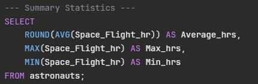

# NASA-Astronaut-Yearbook-Analysis

# Background and Overview
This is a personal learning project designed to practice SQL skills using publicly available NASA astronaut data. Using a Kaggle dataset, I explored astronaut profiles to practice data analysis techniques including summary statistics, conditional logic, grouping, and filtering.The analysis focuses on:

Practicing aggregate functions to summarize spaceflight experience data
Using GROUP BY and HAVING to identify patterns across educational backgrounds
Applying CASE statements to create custom classifications
Building multi-condition filters to extract specific data subsets

The complete SQL code and dataset can be accessed <a href="https://github.com/ElishaMendez/NASA-Astronaut-Yearbook-Analysis" target="_blank">here.</a>

Dataset source: <a href="https://www.kaggle.com/nasa/astronaut-yearbook" target="_blank">Kaggle - NASA Astronaut Yearbook</a>

# Data Structure Overview
- Primary Source: Kaggle NASA Astronaut Yearbook dataset (practice dataset)
- Records: Full roster of NASA astronauts with biographical and mission data
- Key Fields: Name, birth information, educational background (undergraduate and graduate majors), military rank and branch, spaceflight hours, spacewalk hours, mission details, and status
- Analysis Tool: SQL (aggregate functions, conditional logic, grouping, and filtering)

# Executive Summary
### Overview of Findings
This analysis examined NASA astronaut profiles to identify experience patterns and create meaningful classifications. By calculating summary statistics, I found that spaceflight hours vary significantly across the astronaut corps, with some having minimal experience while others have logged over 1,000 hours in space.
I grouped astronauts by their graduate majors and discovered that certain academic backgrounds—particularly in engineering disciplines—tend to correlate with different average flight hours. Using conditional logic, I created a custom ranking system (Novice, Junior Spacewalker, Spacewalker, and Senior Spacewalker) based on total flight hours, providing a clearer way to segment astronauts by expertise level.
Additionally, I used multi-condition filtering to identify astronauts with specific combinations of educational and military backgrounds, such as Mechanical Engineering graduates who hold the rank of Colonel or Major—a profile that appears frequently in the dataset.

Below are key SQL queries used in this analysis:

  
  
  

# Insights Deep Dive
- **Wide Experience Range Reveals Career Stage Distribution**
The analysis shows spaceflight hours vary dramatically from under 10 hours to over 1,000 hours, which appears to reflect natural career progression. I found that becoming a "veteran" astronaut with 500+ hours is relatively rare, achieved by less than 20% of the dataset.
- **Academic Background Influences Mission Assignment Patterns**
Certain graduate majors show consistently lower average flight hours. This pattern suggests these fields may be newer to NASA's selection criteria or potentially associated with support roles. Engineering disciplines, particularly Aerospace and Mechanical Engineering, appear more frequently in the higher flight-hour categories.
- **The "1,000-Hour Club" is Highly Exclusive**
My analysis revealed that only a handful of astronauts achieve Senior Spacewalker status (1,000+ hours), representing years of multiple long-duration missions. The data shows a steep pyramid structure: many novices, fewer mid-career astronauts, and very few veterans.
- **Military Leadership Background Remains a Strong Predictor**
I observed that the combination of engineering degrees with senior military ranks (Colonel/Major) appears frequently among high-experience astronauts. This pattern suggests NASA may value both technical expertise and proven leadership under high-pressure conditions.

# Recommendations
- **Time-Series Trends:** Analyze how astronaut profiles have evolved over decades by grouping astronauts by their selection year to identify shifting priorities in NASA's recruitment strategy
- **Predictive Modeling:** Build a model to predict which astronaut profiles are most likely to achieve 500+ flight hours based on educational background, military rank, and selection year
- **Window Functions:** Implement RANK() and ROW_NUMBER() to identify top performers within each graduate major category
- **Python Integration:** Use pandas and scikit-learn to perform statistical tests on correlations between variables and build classification models

